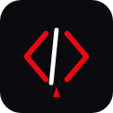

# 🧛 CodeVamp - High Performance Coding Platform

**CodeVamp** is a next-generation competitive programming platform built for speed, performance, and developer experience. It has been re-engineered to be **100% Serverless-ready** and optimized for direct deployment on **Netlify**.



---

## 🚀 Key Features

### 💻 **Advanced Code IDE**
- **Multi-Language Support**: High-performance execution for Python, C++, Java, JavaScript, C, and Go.
- **Serverless Execution**: Powered by the **Piston API**—no heavy background workers needed.
- **Custom Test Cases**: Run your code against specific inputs to debug effectively.
- **Rich Editor**: Premium developer experience with syntax highlighting and minimalist design.

### 🏆 **Contest System**
- **Live Contests**: Compete with others in scheduled programming challenges.
- **Real-Time Leaderboard**: Global rankings powered by WebSockets (Socket.io).
- **Difficulty Scaling**: Curated problem sets from Easy to Hard.

### 🔥 **Daily Challenges (POTD)**
- **Streak System**: Track your consistency with an automated daily problem.
- **Milestone Badges**: Earn special achievements for 3-day and 7-day streaks.

### 📊 **Integrated Profile**
- **Heatmaps**: GitHub-inspired contribution graph for solving history.
- **Stats Dashboard**: Track your solved counts by difficulty and global rank.

---

## 🛠 Tech Stack

### **Frontend**
- **Framework**: React.js (Vite)
- **Styling**: Tailwind CSS (Minimal & Premium)
- **Animations**: Framer Motion
- **Hosting**: Netlify

### **Backend (Netlify Functions)**
- **Framework**: NestJS (deployed as a Serverless Lambda)
- **Language**: TypeScript
- **Database**: MongoDB Atlas
- **Execution**: Piston Code Execution API

---

## 🏗 Deployment (Netlify Optimized)

The platform is designed to be deployed in one click to Netlify.

### 1. MongoDB Setup
Ensure your **MongoDB Atlas** Network Access allows `0.0.0.0/0` (Allow Access from Anywhere) to support Netlify's dynamic IP range.

### 2. Environment Variables
Set these in your Netlify Dashboard:
- `MONGODB_URI`: Your Atlas connection string.
- `JWT_SECRET`: A strong secret key for auth.
- `NODE_ENV`: `production`

### 3. Build Configuration
- **Build command**: `npm install --include=dev && npm run build:api && npm run build:web && mkdir -p apps/api/netlify-deploy && cp apps/api/netlify-function.js apps/api/netlify-deploy/api.js`
- **Publish directory**: `apps/web/dist`
- **Functions directory**: `apps/api/netlify-deploy`

---

## 🚦 Local Development

1. **Install Dependencies**
   ```bash
   npm install
   ```

2. **Environment Setup**
   Create a `.env` in `apps/api/`:
   ```env
   MONGODB_URI=your_mongo_uri
   JWT_SECRET=your_secret
   NODE_ENV=development
   ```

3. **Run Services**
   ```bash
   # Start Backend
   npm run dev:api
   
   # Start Frontend
   npm run dev:web
   ```

---

## 🤝 Contact & Credits

**Made with ❤️ by [Atul Joshi](https://github.com/AtulJoshi1206)**

Founder & Lead Developer of CodeVamp.
